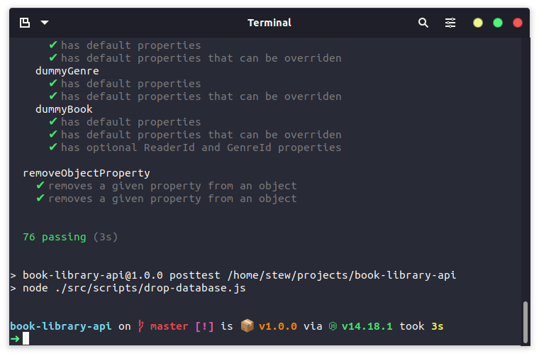

# MCR Codes Book Library API

This is my Book Library API project for [Manchester Codes](https://www.manchestercodes.com/) as part of the Backend module.

## Navigation

* [Description](#description)
* [Features](#features)
* [Requirements](#requirements)
* [Getting Started](#getting-started)
* [Documentation](#documentation)
  * [Readers](#readers)
  * [Authors](#authors)
  * [Genres](#genres)
  * [Books](#books)
* [Testing](#testing)
* [Future Plans](#future-plans)

## Description

The main purpose of this project is to:

* Learn how to take user stories and turn them into requirements.
* Expand my knowledge of database design.
* Learn how to use Sequelize to perform SQL queries.
* Get real world practice with documentation by figuring out how to implement validation on models.

[Back to Top](#navigation)

## Features

* Create, read, update and delete readers, authors, genres and books.
* Associate books with their authors.
* Associate books with their genres.
* Search for books based on author, or genre.
* The readers password is never returned to the users of the API.

[Back to Top](#navigation)

## Requirements

* [Node JS](https://nodejs.org/en/) - JavaScript runtime environment

### Application Dependencies

* [Express](https://expressjs.com/) - to set up the server and manage routes and responses
* [Helmet](https://www.npmjs.com/package/helmet) - to add some security middleware to Express
* [MySQL2](https://github.com/sidorares/node-mysql2#readme) - to work with the MySQL database engine
* [Sequelize](https://www.npmjs.com/package/sequelize) - to work with MySQL using a JavaScript ORM

### Development Dependencies

* [Faker](https://github.com/faker-js/faker) - to generate fake data used for testing
* [Mocha](https://www.npmjs.com/package/mocha) - testing framework of choice for this project
* [Chai](https://www.npmjs.com/package/chai) - testing assertion library used to provide the testing framework (in this case Mocha) with assertions
* [SuperTest](https://www.npmjs.com/package/supertest) - HTTP assertion library used to test HTTP servers
* [Dotenv](https://www.npmjs.com/package/dotenv) - to store environment variables
* [Nodemon](https://www.npmjs.com/package/nodemon) - to run the `npm run start:dev` script, allowing for hot reloading
* [ES Lint](https://eslint.org/) - to analyze the code for style guide problems
* [Prettier](https://prettier.io/) - to format code and keep styling consistent

[Back to Top](#navigation)

## Getting Started

* Pull down a MySQL image from DockerHub
  * `docker pull bbatm9/music_library_mysql`
  * more info: [DockerHub](https://hub.docker.com/r/bbatm9/music_library_mysql)
* Set up the container
  * `docker run -d -p <OUTSIDE_PORT>:<INSIDE_PORT> --name <NAME> -e MYSQL_ROOT_PASSWORD=<PASSWORD> <IMAGE_NAME>`
* Clone this repo
  * e.g. `git clone https://github.com/invertostew/book-library-api.git`
* Change into the repo directory
  * `cd book-library-api` (or the directory you specified the repo to be cloned into)
* Install the dependencies from `package-lock.json`
  * `npm install`
* Create an `.env` and `.env.test` file in the project root
  * `touch .env && touch .env.test`
* Add the following to both `.env` and `.env.test`, switching out the `<VALUE>` as necessary
  * `DB_HOST=<YOUR_DB_HOST>`
  * `DB_USER=<YOUR_DB_USER>`
  * `DB_PASSWORD=<YOUR_DB_PASSWORD>`
  * `DB_PORT=<YOUR_DB_PORT>` (as specified in the `docker run` command)
  * `DB_NAME=<YOUR_DB_NAME>`
  * `APP_PORT=<YOUR_APP_PORT>` (optional, will default to 4000)
  * IMPORTANT: Ensure `DB_NAME` is different in `.env` than it is in `.env.test`, the database in `.env.test` will be dropped each time.
* To start the production server:
  * `npm start`
* To start the development server:
  * `npm run start:dev`

[Back to Top](#navigation)

## Documentation

### Readers

| HTTP Verb | Route        | Required Fields             |
| --------- | ------------ | --------------------------- |
| GET       | /readers     |                             |
| POST      | /readers     | `name`, `email`, `password` |
| GET       | /readers/:id |                             |
| PATCH     | /readers/:id |                             |
| DELETE    | /readers/:id |                             |

#### Example Request Body

```javascript
// Endpoint: POST /readers
{
    "name": "First Last",
    "email": "firstlast@gmail.com",
    "password": "VerySecurePassword"
}

// Endpoint: PATCH /readers/1
{
    "name": "First Last Updated!"
}
```

##### Options and Validation

* `name` (required)
  * must be provided
* `email` (required)
  * must be provided
  * must be an email address
* `password` (required)
  * must be provided
  * must be more than 8 characters
  * must be less than 64 characters

[Back to Top](#navigation)

### Authors

| HTTP Verb | Route        | Required Fields |
| --------- | ------------ | --------------- |
| GET       | /authors     |                 |
| POST      | /authors     | `author`        |
| GET       | /authors/:id |                 |
| PATCH     | /authors/:id |                 |
| DELETE    | /authors/:id |                 |

#### Example Request Body

```javascript
// Endpoint: POST /authors
{
    "author": "First Last"
}

// Endpoint: PATCH /authors/1
{
    "author": "First Last Updated!"
}
```

##### Options and Validation

* `author` (required)
  * must be provided
  * must be unique

[Back to Top](#navigation)

### Genres

| HTTP Verb | Route       | Required Fields |
| --------- | ----------- | --------------- |
| GET       | /genres     |                 |
| POST      | /genres     | `genre`         |
| GET       | /genres/:id |                 |
| PATCH     | /genres/:id |                 |
| DELETE    | /genres/:id |                 |

#### Example Request Body

```javascript
// Endpoint: POST /genres
{
    "genre": "Sci-Fy"
}

// Endpoint: PATCH /genres/1
{
    "genre": "Sci-Fi"
}
```

##### Options and Validation

* `genre` (required)
  * must be provided
  * must be unique

[Back to Top](#navigation)

### Books

| HTTP Verb | Route      | Required Fields     | Optional Fields               |
| --------- | ---------- | ------------------- | ----------------------------- |
| GET       | /books     |                     |                               |
| POST      | /books     | `title`, `AuthorId` | `ISBN`, `ReaderId`, `GenreId` |
| GET       | /books/:id |                     |                               |
| PATCH     | /books/:id |                     |                               |
| DELETE    | /books/:id |                     |                               |

#### Example Request Body

```javascript
// Endpoint: POST /books
{
    "title": "Book Title",
    "ISBN": 1234567890,
    "ReaderId": 1,
    "AuthorId": 1,
    "GenreId": 1
}

// Endpoint: PATCH /books/1
{
    "title": "New Book Title",
    "ISBN": 1234567890123
}
```

##### Options and Validation

* `title` (required)
  * must be provided
* `ISBN` (optional)
  * must be between 10 and 13 characters to match ISBN-10 or ISBN-13
  * must be unique
* `ReaderId` (optional)
  * must be a valid `ReaderId` if provided
* `AuthorId` (required)
  * must be a valid `AuthorId`
* `GenreId` (optional)
  * must be a valid `GenreId` if provided

[Back to Top](#navigation)

## Testing

Built using a TDD approach. Tests have been split out into unit tests and integration tests. Where possible tests where written as failing tests first, and then built out as per the tests, and later refactored and tested again. At some points it was necessary to spike, in which case I would delete the code, write the test and then re-implement the code.

All tests are located inside of the `./src/__tests__` directory.

If you wish to run the tests for yourself, you can install Faker, Mocha, Chai and SuperTest by running `npm install` and from there you can run the tests by running `npm test`.

I also used [Insomnia](https://insomnia.rest/) to send requests to my RESTful API endpoints as documented above.




[Back to Top](#navigation)

## Future Plans

* I would like to condense down the CRUD tests in the future to use the CRUD helper functions where possible to make tests more DRY.

[Back to Top](#navigation)
